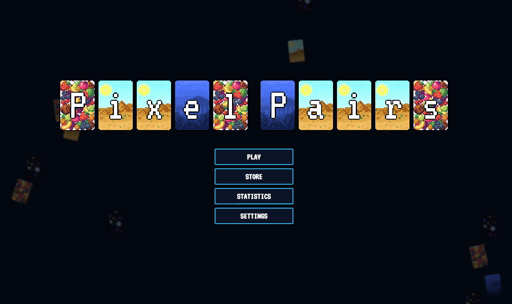
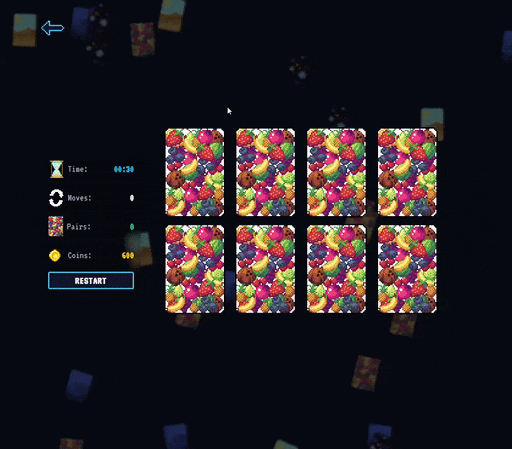
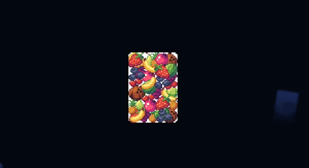
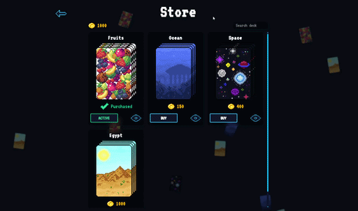
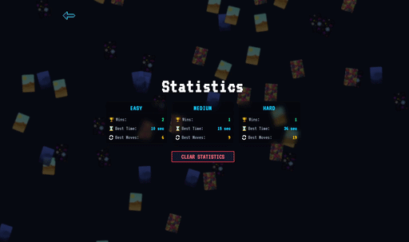
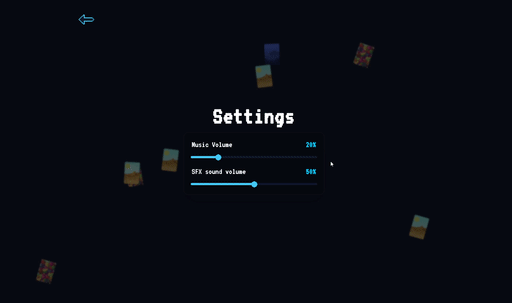

# Pixel Pairs




[Description](#description) • [Features](#features) • [Tech Stack](#techstack) • [Installation](#installation)

## Description

**Pixel Pairs** is a responsive, retro-style card matching (Memory) game built with `React`, `TypeScript`, and `Tailwind CSS`. It delivers a rich arcade experience with progression, in-game economy, deep customization, and fully hand-drawn pixel-art assets.

## Features

### 🎮 Adaptive Game Loop & Grid Scaling

Three difficulty levels (Easy, Medium, Hard) dynamically adjust the deck size — from 8 to 16 cards. Each difficulty generates a unique board layout, and the grid automatically scales to fit any screen size.



### 🎨 Theme Customization

Four fully hand-drawn themes: Fruits, Ocean, Space, and Ancient Egypt. Each theme features unique illustrations for both the front and back of the cards



### 🛒 In-Game Store & Economy

Earn coins by winning rounds and spend them in the store to unlock new card decks. The store includes:

- Smart keyword search — filter themes by name or tags
- Live preview — see every card in the deck before purchasing



### 📊 Player Statistics

Track your performance across all difficulty levels:

- **Wins** — total victories per difficulty
- **Best Time** — fastest completion for each mode
- **Best Moves** — most efficient round per difficulty



### 🔉 Audio Mixer with Persistent Settings

The audio system is powered by React Context and works like a real hardware mixer:

- **Music** — automatically loops background track
- **Sound Effects** — separate sliders for clicks, matches, wins, and errors



All audio settings, along with your game progress (unlocked themes, coin balance, statistics), are automatically saved to `localStorage` and restored on reload.

## TechStack

- **React** — UI and state management
- **TypeScript** — type safety and better DX
- **Tailwind CSS** — responsive styling
- **React Context** — audio system only (music + SFX mixer)
- **Custom Hooks** + useReducer — game logic, progress, and state transitions
- **localStorage** — persistent player data

## Installation

Clone the repository

```bash
git clone https://github.com/Woefulking/Pixel-Pairs
cd Pixel-Pairs
```

Install dependencies

```bash
npm install
```

Run the project

```bash
npm run dev
```
